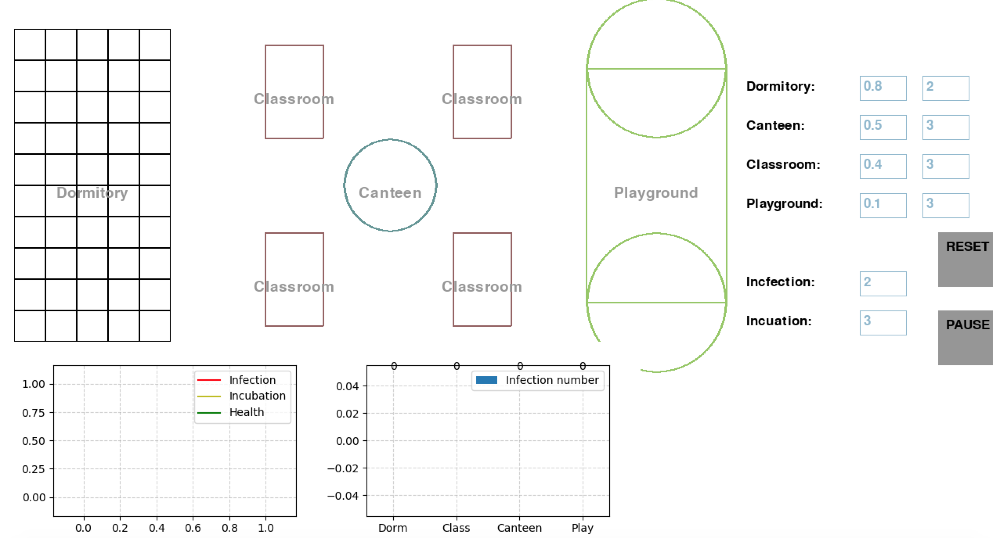
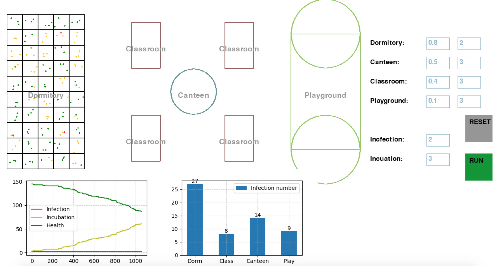
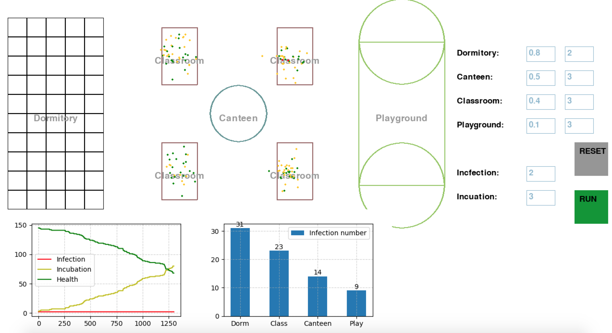

# CS177H-project

The simple simulator of the spread of virus. More details are shown in the interim report and final report.([interim report](./interim_report/interim-report.pdf),)

## Prerequisites:

### 1. Libraries

* Pygame
* Matplotlib
* Numpy

## How to use:

To start the simulator, just cd into root and execute:

`python3 pre1.py`

Then,  the interface of this simulator shows up like below:

There are several parameters in the boxes on the right panel about the infection variables of each scene like dormitory, canteen, classroom and playground. Click the PAUSE button to start the simulation, and  click the RESET button to reset the simulation. 

Each simulation will return a recording file in format `.txt`, and stored in folder [doc](./doc) with filename of id and date.